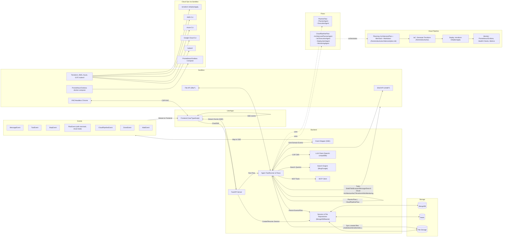

# LADS

This repository contains the LADS system (Local AI Deployment System).

Quick start diagram:



Run (development):

```bash
docker compose -f docker-compose-development.yml up -d
```

Run (example images):

```bash
docker compose -f docker-compose.yml up -d
```

Notes:
- Frontend at http://localhost:5173
- Backend at http://localhost:8000
- Sandbox API at http://localhost:8080